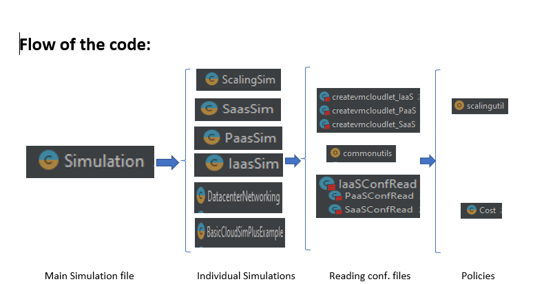

# Harsh Mishra - UIN 653554247

# Homework 1 (CS 441)

### Problem Statement: Create cloud simulators in Scala for evaluating executions of applications in cloud datacenters with different characteristics and deployment models.

#### This Git repo contains simulation of various Cloud architectures using the CloudSim framework. This baseline of this repo was taken from: git@github.com:0x1DOCD00D/CloudOrgSimulator.git.


#### Instructions to run the code:
##### Development Environment
+ **OS:** Windows 10
+ **IDE** IntelliJ IDEA
+ **Java Version** 16.0.2
+ **Scala Version** 3.0.2


##### Running the application
+ Clone the project and run it using sbt or through an IDE.

```
sbt clean compile test
``` 
```
sbt clean compile run
```
### To know more about the flow of the code and analysis of the results, refer the doc folder.

## Thank you

